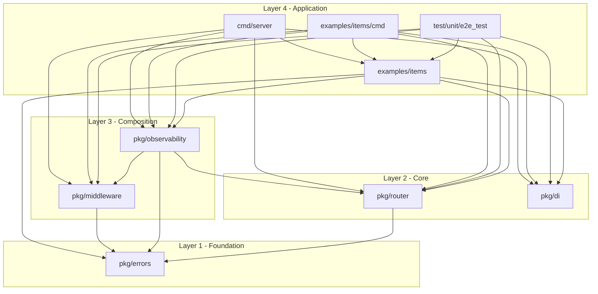

# Package Design

This document describes the intended module layout and dependencies for the lightweight
HTTP framework. It is the **target** design; update it after each phase so it matches the
real import graph.

## Target Module Dependency Diagram

The diagram shows the full target architecture. Updated after Phase 8 to match the real import graph.



### Phase 8 — Real Import Graph

`pkg/errors` imports only the Go standard library: `context`, `encoding/json`, `errors`,
`fmt`, `log/slog`, `net/http`, `runtime/debug`.

`pkg/router` imports the Go standard library (`context`, `encoding/json`, `errors`, `fmt`,
`net/http`, `strconv`, `strings`, `sync`) **and** `pkg/errors`.

`pkg/middleware` imports the Go standard library (`fmt`, `log/slog`, `net/http`) **and**
`pkg/errors`.

`pkg/di` imports only the Go standard library: `context`, `errors`, `fmt`, `reflect`,
`strings`, `sync`. It does not import any `pkg/` package and is not imported by
`pkg/errors`, `pkg/router`, or `pkg/middleware`.

`pkg/observability` imports the Go standard library (`context`, `crypto/rand`, `encoding/hex`,
`log/slog`, `net/http`, `sync`, `time`) **and** `pkg/errors`, `pkg/router`, `pkg/middleware`.

`examples/items` (library package) imports `pkg/router`, `pkg/errors`, `pkg/di`,
`pkg/observability`. It is not imported by any `pkg/` package.

`cmd/server` and `examples/items/cmd` import `examples/items` and the four `pkg/` packages
they need for wiring. Both are main packages at the composition root (Layer 4).

## Layer Rules

- Dependencies point downward only. A package never imports a sibling in its own layer or
  anything above it.
- `pkg/errors` is the foundation: it imports nothing from `pkg/`.
- `pkg/router` does not know that `pkg/middleware` exists; middleware wraps handlers from
  the outside.
- `pkg/observability` is wired in through the middleware chain, not called by the router.
- `pkg/di` is a composition-root tool. Only `cmd/` and `examples/` construct a container.
- Nothing under `pkg/` imports `cmd/` or `examples/`.

## Verifying the Diagram

After each phase, regenerate the real graph and reconcile it with the diagram above:

```bash
source ./environment.sh && go list -deps -f '{{.ImportPath}} -> {{join .Imports " "}}' ./... \
  | grep 'github.com/example/lightweight-http'
```

If the real graph has an edge the diagram does not, either the diagram is stale or the
layering rule was violated. Fix the code first; only update the diagram when the new edge
is legitimate.

## External Dependencies

None. Standard library only (ADR-001). This section must stay empty.
