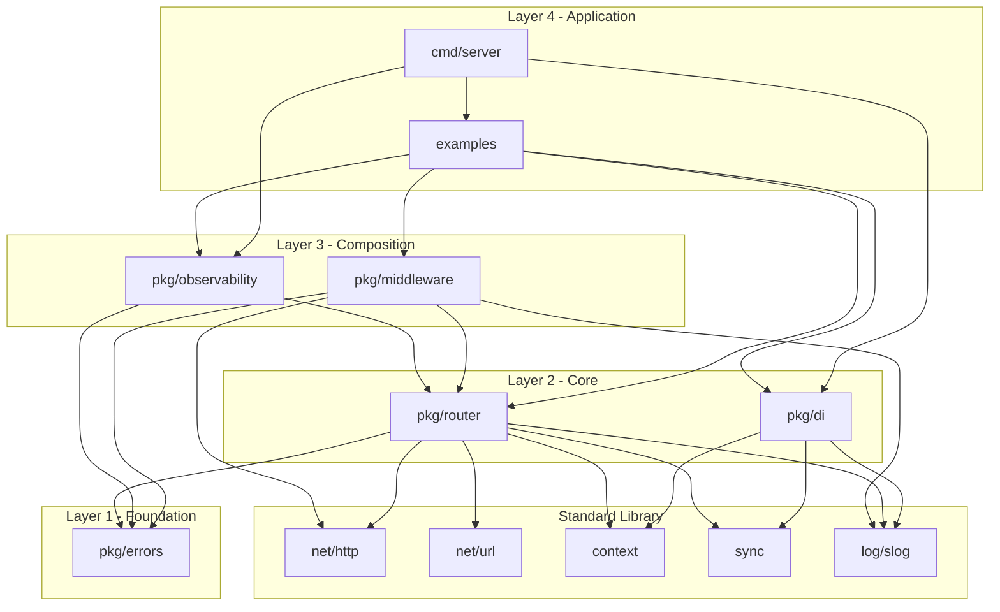

# Package Design

This document describes the intended module layout and dependencies for the lightweight
HTTP framework. It is the **target** design; update it after each phase so it matches the
real import graph.

## Target Module Dependency Diagram



> **Phase 5 note:** `pkg/middleware` imports `pkg/errors` (Layer 3 → Layer 1) for the
> JSON error envelope. `pkg/errors` imports `runtime/debug` for optional stack capture.
>
> **Phase 6 note:** `pkg/di` is now implemented. It imports only standard library packages
> (`context`, `sync`, `log/slog`, `fmt`, `strings`); it does NOT import `pkg/errors`
> because its own error types are DI-specific (not HTTP errors).
>
> **Phase 7 note:** `pkg/observability` is now implemented. It imports `pkg/errors` (Layer 1)
> for request-ID context helpers and `pkg/router` (Layer 2) for `RoutePatternHolder` — a
> mutable pointer the router writes the matched pattern into, enabling metrics keyed by route
> pattern rather than concrete path (ADR-012). Layer 3 → Layer 2 is an allowed dependency.
>
> **Phase 8 note:** `examples/items` (Layer 4) exports `NewHandler` and is imported by
> `cmd/server` (Layer 4) as the composition root. Both are Application-layer packages;
> `cmd/server` acts as the wiring entry point and may import from `examples/` in this role.
> `cmd/server` also imports `pkg/di` and `pkg/observability` directly for container
> construction and recorder wiring.

## Layer Rules

- Dependencies point downward only. A package never imports a sibling in its own layer or
  anything above it.
- `pkg/errors` is the foundation: it imports nothing from `pkg/`.
- `pkg/router` does not know that `pkg/middleware` exists; middleware wraps handlers from
  the outside.
- `pkg/observability` is wired in through the middleware chain, not called by the router.
- `pkg/di` is a composition-root tool. Only `cmd/` and `examples/` construct a container.
- Nothing under `pkg/` imports `cmd/` or `examples/`.

## Verifying the Diagram

After each phase, regenerate the real graph and reconcile it with the diagram above:

```bash
source ./environment.sh && go list -deps -f '{{.ImportPath}} -> {{join .Imports " "}}' ./... \
  | grep 'github.com/example/lightweight-http'
```

If the real graph has an edge the diagram does not, either the diagram is stale or the
layering rule was violated. Fix the code first; only update the diagram when the new edge
is legitimate.

## External Dependencies

None. Standard library only (ADR-001). This section must stay empty.
